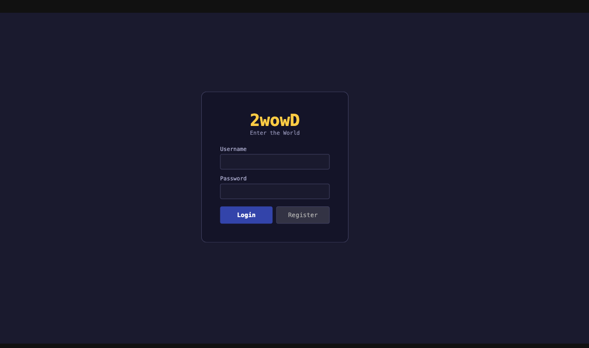
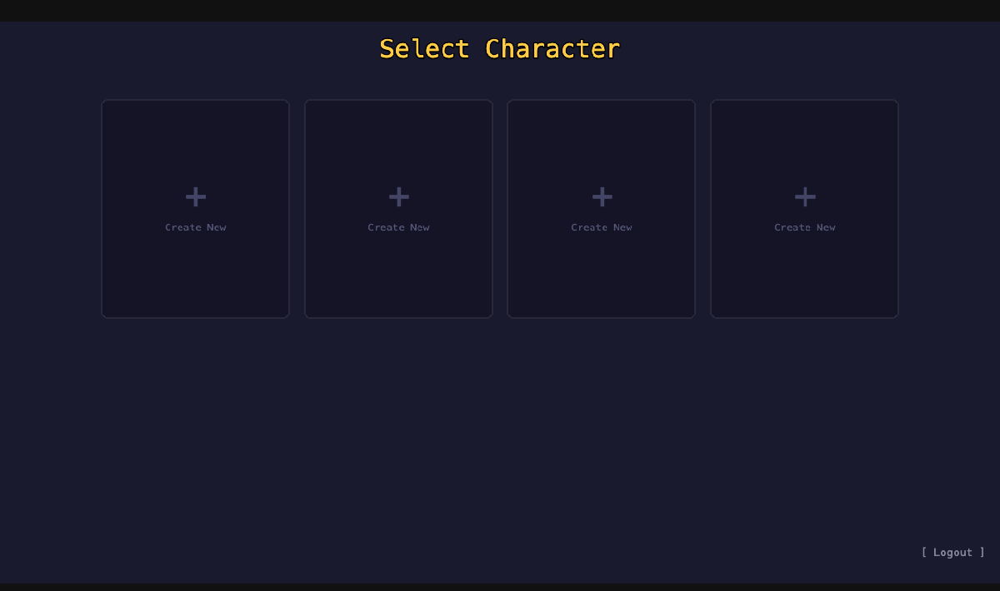
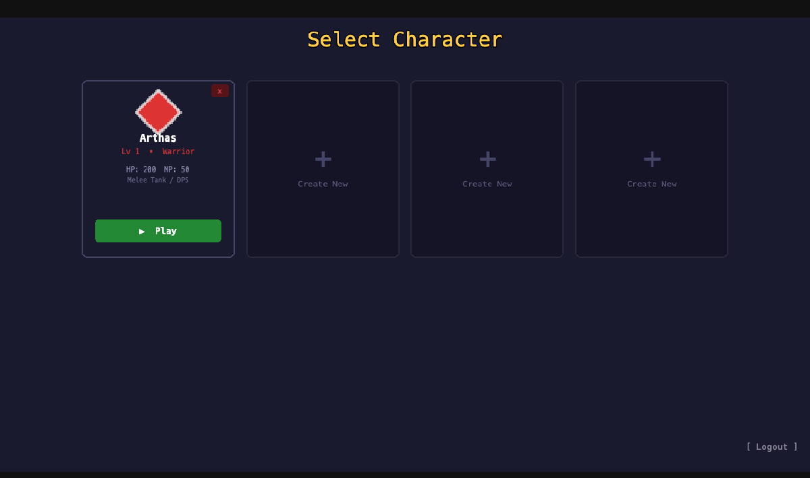
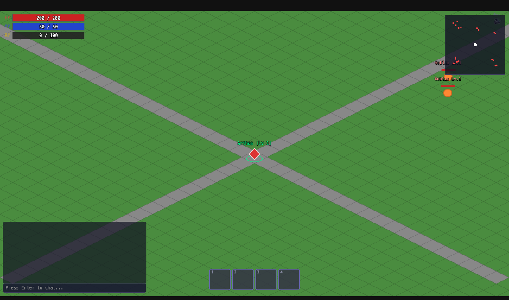

# 🎮 2wowD — 2D Isometric MMO

A 2D isometric multiplayer online RPG built with TypeScript, Phaser.js, and Node.js.

## Screenshots

| Login | Character Select | Create Character |
| ----- | ---------------- | ---------------- |
|  |  |  |

| Character Created | In-Game |
| ----------------- | ------- |
|  |  |

## Features

- **4 Playable Classes** — Warrior, Mage, Rogue, Priest, each with unique abilities
- **Real-Time Combat** — WebSocket-driven combat with critical hits, buffs, and debuffs
- **Isometric Rendering** — Smooth 2D isometric world powered by Phaser.js
- **Authentication System** — Account creation and login with scrypt password hashing
- **SQLite Persistence** — Player data, characters, and game state stored with better-sqlite3
- **Buffs & Debuffs** — Status effects that modify combat and movement
- **XP & Leveling** — Gain experience from combat, level up and grow stronger
- **Minimap** — Real-time minimap showing players, mobs, and terrain
- **Sound & Music** — Ambient audio and sound effects for an immersive experience

## Tech Stack

| Layer | Technology |
| ----- | ---------- |
| Client | [Phaser.js](https://phaser.io/) + [Vite](https://vitejs.dev/) |
| Server | Node.js + [ws](https://github.com/websockets/ws) |
| Shared | TypeScript types & protocol definitions |
| Database | [better-sqlite3](https://github.com/WiseLibs/better-sqlite3) |
| Build | npm workspaces + TypeScript |
| Infra | Docker + nginx |

## Getting Started

### Prerequisites

- Node.js 20+
- npm 9+

### Install & Run

```bash
# Install dependencies
npm install

# Build all packages
npm run build

# Start the server (port 8080)
npm run dev:server

# In another terminal — start the client
npm run dev:client
```

## Docker

Run the full stack with Docker Compose:

```bash
docker-compose up --build
```

- **Client**: [http://localhost:3000](http://localhost:3000)
- **Server**: WebSocket on port 8080

## Project Structure

```text
2wowD/
├── packages/
│   ├── shared/      # Shared types, constants, protocol definitions
│   ├── server/      # Game server — Node.js, WebSocket, SQLite
│   └── client/      # Game client — Phaser.js, Vite
├── docker-compose.yml
├── Dockerfile.server
├── Dockerfile.client
└── nginx.conf
```

## License

This project is licensed under the MIT License — see the [LICENSE](LICENSE) file for details.
